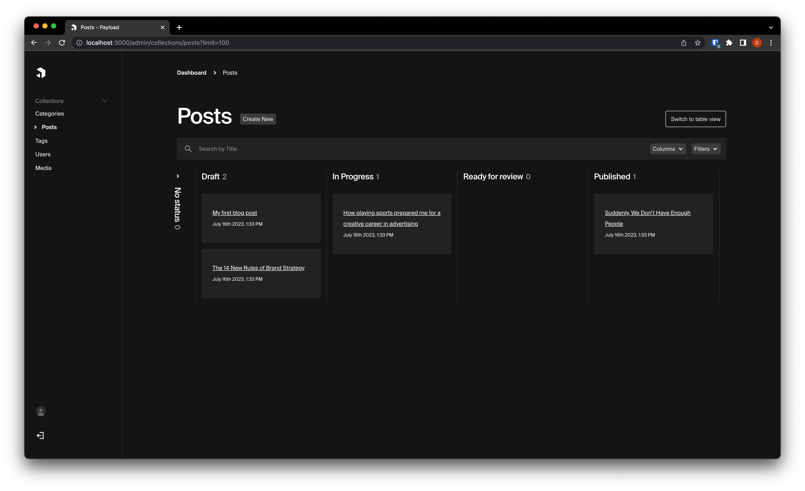

# Payload workflow plugin
> **Note**
> This plugin is currently under active development and still in an early stage.
> Check the [roadmap](#roadmap) below in this readme for more details / upcoming features.



## Installation
```shell
$ yarn add payload-workflow
```

## Basic usage
```typescript
import { PayloadWorkflow } from 'payload-wokflow';

const config = buildConfig({
  collections: [...],
  plugins: [
    PayloadWorkflow({
      'my-collection-slug': {
        statuses: [
          {value: 'draft', label: 'Draft'},
          {value: 'in-progress', label: 'In Progress'},
          {value: 'ready-for-review', label: 'Ready for review'},
          {value: 'published', label: 'Published'},
        ],
        defaultStatus: 'draft'
      }
    })
  ],
});
```

## Some things to know about using the plugin
After installing and configuring the plugin as described above, you can visit the Payload admin and select the collection you configured the workflow for.
Before using the plugin, there are some things to know about how the plugin behaves.

### Differences with the draft/publish system of Payload.
The workflow plugin introduces a new field called `workflowStatus`. This column does not interact with the draft/publish system of Payload whatsoever.

You can "integrate" the workflow status with the draft/publish system of Payload yourself by using [hooks](https://payloadcms.com/docs/hooks/overview).
For example: Automatically publish the document when the `workflowStatus` has been changed to `published`.

### Workflow view currently only shows documents with `workflowStatus` filled.
When installed on an existing Payload setup, existing document don't have the `workflowStatus` field filled in.
The `workflowStatus` filed is being used to group the documents in the defined columns on the board.

Want to view documents without a workflow status? Press the "show table view" on the top right to switch back to the default table view.
In the future there will be a toggleable column showing documents without a `workflowStatus`.

<h2 id="roadmap">Roadmap</h3>
Upcoming Features / Ideas. Have a suggestion for the plugin? Feel free to open an issue or contribute!

- [ ] Customize card properties (currently displays `title` and `createdAt`)
- [ ] Edit relationships directly from the card (e.g., assigning users to a document)
- [ ] Toggleable column for posts without a workflow status (Currently, documents lacking `workflowStatus` aren't visible on the board)
- [ ] Lazy loading of column contents when scrolling (Currently, board only shows `defaultLimit` amount of cards)
- [ ] Permissions for changing statuses
- [ ] Allowed transitions between statuses
- [ ] Integration with the draft/publish system of Payload (?)