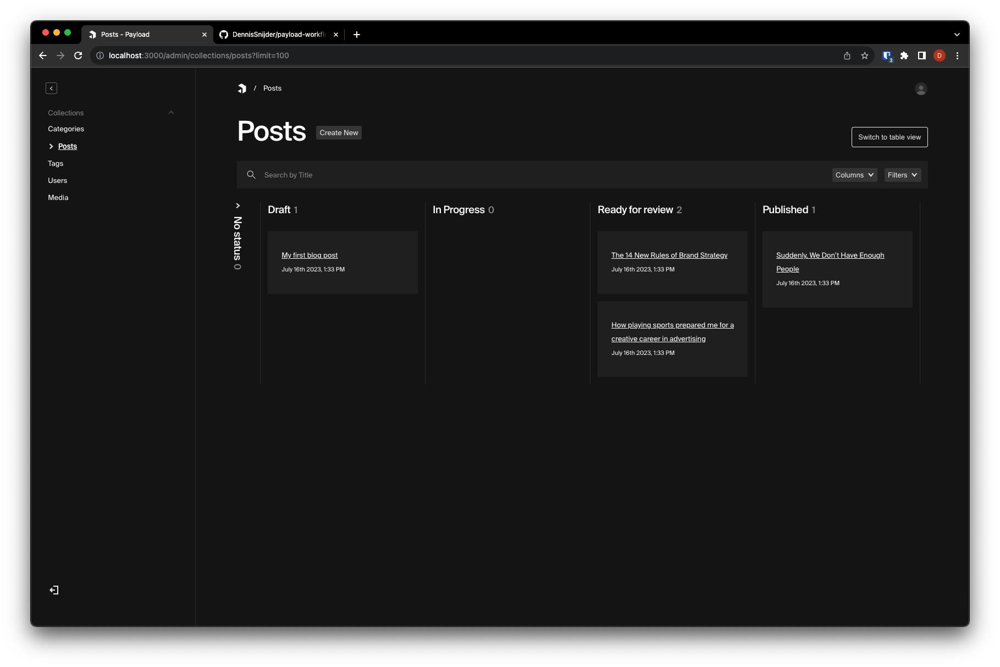

# Payload workflow plugin

> **Note**
> This plugin is currently under active development and still in an early stage.
> Check the [roadmap](#roadmap) below in this readme for more details / upcoming features.

<picture>
  <source media="(prefers-color-scheme: dark)" src="./preview-dark.png" />
  <source media="(prefers-color-scheme: light)" src="./preview-light.png" />
  
</picture>

## Installation
The most recent version of payload-workflow currently only supports Payload 2.0 and up. 
For older payload versions, please use `payload-workflow@0.2.0`

```shell
$ yarn add payload-workflow
```

## Basic usage

```typescript
import { payloadWorkflow } from 'payload-workflow';

const config = buildConfig({
  collections: [ ... ],
  plugins: [
    payloadWorkflow({
      'my-collection-slug': {
        statuses: [
          {value: 'draft', label: 'Draft'},
          {value: 'in-progress', label: 'In Progress'},
          {value: 'ready-for-review', label: 'Ready for review'},
          {value: 'published', label: 'Published'},
        ],
        defaultStatus: 'draft',
        hideNoStatusColumn: false
      }
    })
  ],
});
```

## Differences with the draft/publish system of Payload.

The workflow plugin introduces a new field called `workflowStatus`. This field does not interact with the draft/publish
system of Payload.

You can "integrate" the workflow status with the draft/publish system of Payload yourself by
using [Payloads hooks](https://payloadcms.com/docs/hooks/overview).

For example: Automatically publish the document when the `workflowStatus` has been changed to `published`.

<h2 id="roadmap">Roadmap</h2>
Upcoming Features / Ideas. Have a suggestion for the plugin? Feel free to open an issue or contribute!

- [X] Payload 2.0 support
- [ ] Customize card properties (currently displays `title` and `createdAt`)
- [ ] Edit relationships directly from the card (e.g., assigning users to a document)
- [X] Toggleable column for posts without a workflow status (Currently, documents lacking `workflowStatus` aren't
  visible on the board)
- [ ] Lazy loading of column contents when scrolling (Currently, board only shows `defaultLimit` amount of cards)
- [ ] Permissions for changing statuses
- [ ] Allowed transitions between statuses
- [ ] Integration with the draft/publish system of Payload (?)
